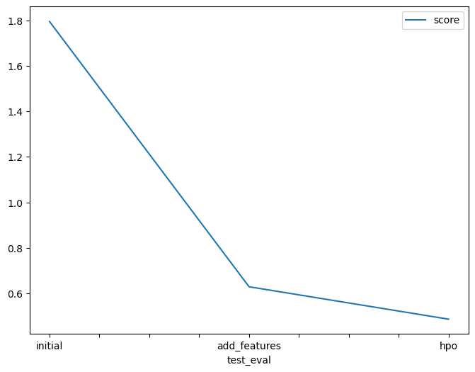

# Report: Predict Bike Sharing Demand with AutoGluon Solution
#### Mohamed Mohsen

## Initial Training
### What did you realize when you tried to submit your predictions? What changes were needed to the output of the predictor to submit your results?
1- When I used the raw dataset before analyzing the data or feature engineering the model did not perfume well
2- I needed to replace the negative numbers with 0, to be able to submit my results to Kaggle.

### What was the top ranked model that performed?
the second run with more features but no tuning og hyperparameters. The score was 0.48549 and was better than the one with the tuning.

## Exploratory data analysis and feature creation
### What did the exploratory analysis find and how did you add additional features?
For additional features I divided the datetime in month, day, year and hour. 

### How much better did your model preform after adding additional features and why do you think that is?
The best improvement was because of the split of the datetime field into year, month, day, and hour.

## Hyper parameter tuning
### How much better did your model preform after trying different hyper parameters?
It was useful in some cases, but it did not improve model performance by much, some configurations harmed the model performance.

### If you were given more time with this dataset, where do you think you would spend more time?
data analysis in order to get more information about this dataset , and do more research about the hyperparameters.

### Create a table with the models you ran, the hyperparameters modified, and the kaggle score.
|model|hpo1|hpo2|hpo3|score|
|--|--|--|--|--|
|initial| default_vals | default_vals | default_vals | 1.79590 |
|add_features| default_vals | default_vals | default_vals | 0.62819 |
|hpo| GBM (Light gradient boosting) | XGB (XGBoost) | CAT (CATBoost) | 0.48549 |

### Create a line plot showing the top model score for the three (or more) training runs during the project.

TODO: Replace the image below with your own.

### Create a line plot showing the top kaggle score for the three (or more) prediction submissions during the project.

TODO: Replace the image below with your own.

## Summary
TODO: Add your explanation

