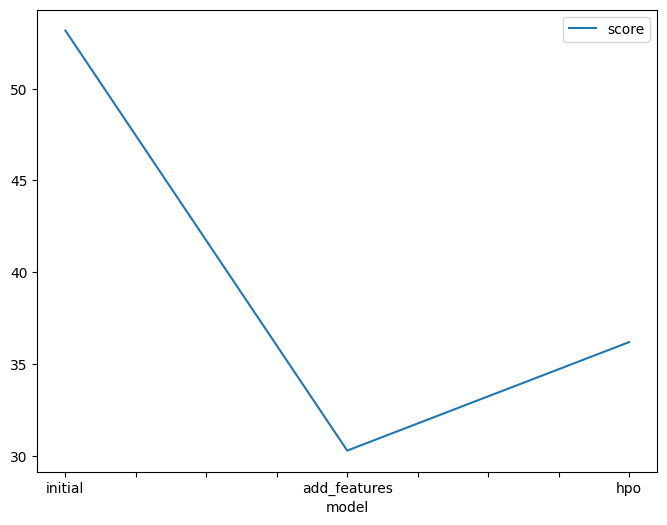

# Report: Predict Bike Sharing Demand with AutoGluon Solution
#### Mohamed Mohsen

## Initial Training
### What did you realize when you tried to submit your predictions? What changes were needed to the output of the predictor to submit your results?
1- When I used the raw dataset before analyzing the data or feature engineering the model did not perfume well
2- I needed to replace the negative numbers with 0, to be able to submit my results to Kaggle.

### What was the top ranked model that performed?
The top ranked model , i.e. the model with the lowest root mean square error (RMSE), was the Weighted_Ensemble_L3 model which is basically a model formed by stacking 3 layers of the previously trained models to achieve the highest possible validation accuracy.

## Exploratory data analysis and feature creation
### What did the exploratory analysis find and how did you add additional features?
From plotting histograms at the EDA step, I deduced that :

some features were binary such as [holiday, working day]
some features were nearly normally distributed such as [temp, atemp, humidity, windspeed]
some features were categorical such as [season, weather] it also seemed that although the data was nearly uniformly distributed among the 4 seasons, most of the data had a certain weather category (1).
The data was nearly uniformly distributed in a monthly fashion through the years 2011, 2012 where the first 19 days of each month were used for training and the rest were used for testing and the data was recorded in different hours throughout the day.
I followed the notebook suggestion of adding the hour feature to the data which seemed reasonable since it is a more general feature and might give the trained models more intuition to which hours of the day in general might have the largest bike share demand without specifying a certain year, month or day.
 
### How much better did your model preform after adding additional features and why do you think that is?
The best model's rmse decreased from 53.159983 to 30.279832.1 as a validation score which is a huge improvement also the test error (root mean square logarithmic error rmsle) decreased from 1.79590 to 0.62819 which is also a huge improvement in performance.
I think that happend because the hour feature gives the trained models better information and intuition about which hours in the day in general the bike share demand increases or decreases without specifying a certain year, month or day and according to the hour feature histogram it seems that the data was recorded nearly equally on all the hours of the day so the hour feature holds useful information.

## Hyper parameter tuning
### How much better did your model preform after trying different hyper parameters?
After performing hyperparameter optimization via a random search method using the data with the added hour feature, the model's training rmse increased from 30.279832 to 36.187504 for the best model. However, the model's test error decreased from 0.0.62819 to 0.48549. This gives an indication that the new model has a bit higher bias, but better variance as it had better generalization for the test data. I think this is because I focused on tree based models with boosting ensemble technique that performed best with the default settings mainly Gradient boosting, CATboost and XGboost during hpo, while before hpo autogluon would try alot more types of models so it might have been slightly overfitting the data.

### If you were given more time with this dataset, where do you think you would spend more time?
data analysis in order to get more information about this dataset , and do more research about the hyperparameters.

### Create a table with the models you ran, the hyperparameters modified, and the kaggle score.
|model|hpo1|hpo2|hpo3|score|
|--|--|--|--|--|
|initial| default_vals | default_vals | default_vals | 1.79590 |
|add_features| default_vals | default_vals | default_vals | 0.62819 |
|hpo| GBM (Light gradient boosting) | XGB (XGBoost) | CAT (CATBoost) | 0.48549 |

### Create a line plot showing the top model score for the three (or more) training runs during the project.

TODO: Replace the image below with your own.

### Create a line plot showing the top kaggle score for the three (or more) prediction submissions during the project.

TODO: Replace the image below with your own.

## Summary
I believe that the project showed me how important is feature engineering as well as hyperparameter optimization are to the machine learning workflow. I think it is kind of an iterative process where we should alternate between extracting new features from the given data, applying EDA then trying different models on the data with new features and so on till reaching a reasonable value for the validation and test errors.
